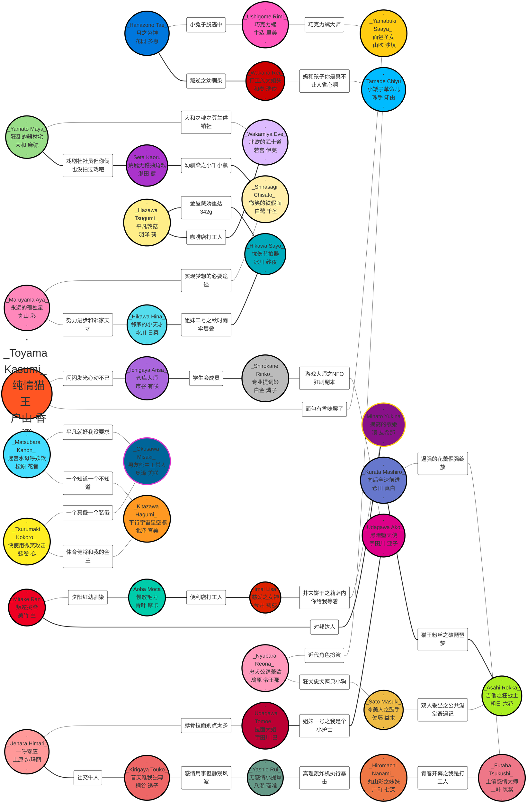
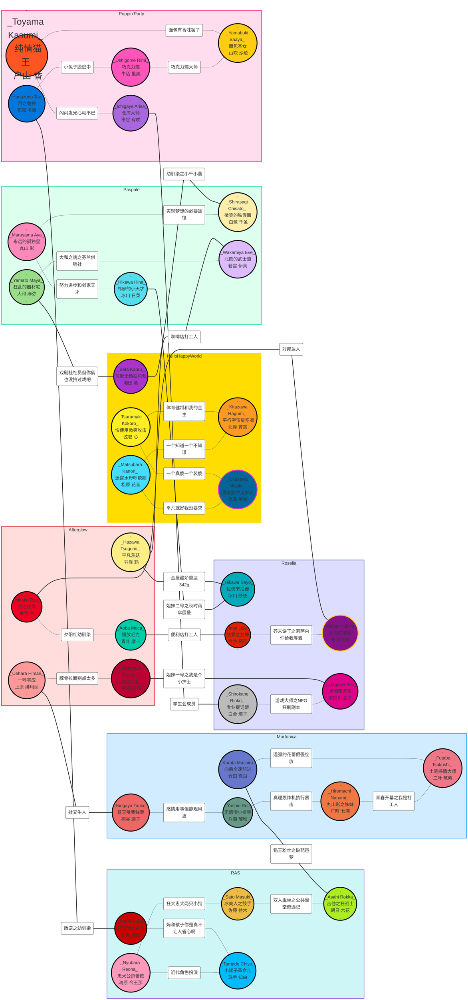

## 简介
人物圈内是应援色 有某些可能有两个应援色(ykn中之人说你呢!!)    
团圈内是团的首要(浅色)应援色, 团圈外框是团的次要(深色)应援色    

根据 BanGDream 2023 新年限定贺卡整理

# 个人关系图

```mermaid
%%{
    init: { 
        "flowchart": {
            "useMaxWidth": false
        },
        "theme": "default",
        "themeVariables": {
            "nodeBorder" : "#000000",
            "mainBkg" : "#FFFFFF",
            "nodeTextColor" : "#000000",
            "fontFamily": "arial",
            "fontSize": "25px",
            "background":"#FFFFFF",
            "primaryTextColor":"#000000"
        }
    } 
}%%

flowchart LR; 

%%%% General People Style
    1((" .<br>_Toyama Kasumi_ <br> 纯情猫王 <br> 户山 香澄<br>."));
    style 1 fill:#FF5522,stroke:#000000,stroke-width:5px,font-size:50px;
    2((" .<br>_Hanazono Tae_ <br> 月之兔神 <br> 花园 多惠<br>."));
    style 2 fill:#0077DD,stroke:#000000,stroke-width:5px;
    3((" .<br>_Ushigome Rimi_ <br> 巧克力螺 <br> 牛込 里美<br>."));
    style 3 fill:#FF55BB,stroke:#000000,stroke-width:5px;
    4((" .<br>_Yamabuki Saaya_ <br> 面包圣女 <br> 山吹 沙绫<br>."));
    style 4 fill:#FFCC11,stroke:#000000,stroke-width:5px;
    5((" .<br>_Ichigaya Arisa_ <br> 仓库大师 <br> 市谷 有咲<br>."));
    style 5 fill:#AA66DD,stroke:#000000,stroke-width:5px;
    6((" .<br>_Mitake Ran_ <br> 叛逆挑染 <br> 美竹 兰<br>."));
    style 6 fill:#EE0022,stroke:#000000,stroke-width:5px;
    7((" .<br>_Aoba Moca_ <br> 慢放毛力 <br> 青叶 摩卡<br>."));
    style 7 fill:#00CCAA,stroke:#000000,stroke-width:5px;
    8((" .<br>_Uehara Himari_ <br> 一呼零应 <br> 上原 绯玛丽<br>."));
    style 8 fill:#FF9999,stroke:#000000,stroke-width:5px;
    9((" .<br>_Udagawa Tomoe_ <br> 拉面大姐 <br> 宇田川 巴<br>."));
    style 9 fill:#BB0033,stroke:#000000,stroke-width:5px;
    10((" .<br>_Hazawa Tsugumi_ <br> 平凡茨菇 <br> 羽泽 鸫<br>."));
    style 10 fill:#FFEE88,stroke:#000000,stroke-width:5px;
    11((" .<br>_Maruyama Aya_ <br> 永远的孤独星 <br> 丸山 彩<br>."));
    style 11 fill:#FF88BB,stroke:#000000,stroke-width:5px;
    12((" .<br>_Hikawa Hina_ <br> 邻家的小天才 <br> 冰川 日菜<br>."));
    style 12 fill:#55DDEE,stroke:#000000,stroke-width:5px;
    13((" .<br>_Shirasagi Chisato_ <br> 微笑的铁假面 <br> 白鹭 千圣<br>."));
    style 13 fill:#FFEEAA,stroke:#000000,stroke-width:5px;
    14((" .<br>_Yamato Maya_ <br> 狂乱的器材宅 <br> 大和 麻弥<br>."));
    style 14 fill:#99DD88,stroke:#000000,stroke-width:5px;
    15((" .<br>_Wakamiya Eve_ <br> 北欧的武士道 <br> 若宫 伊芙<br>."));
    style 15 fill:#DDBBFF,stroke:#000000,stroke-width:5px;
    16((" .<br>_Minato Yukina_ <br> 孤高的歌姬 <br> 凑 友希那 <br>."));
    style 16 fill:#881188,stroke:#FFCC11,stroke-width:5px;
    17((" .<br>_Hikawa Sayo_ <br> 忧伤节拍器 <br> 冰川 纱夜 <br>."));
    style 17 fill:#00AABB,stroke:#000000,stroke-width:5px;
    18((" .<br>_Imai Lisa_<br> 慈爱之女神 <br> 今井 莉莎 <br>."));
    style 18 fill:#DD2200,stroke:#000000,stroke-width:5px;
    19((" .<br>_Udagawa Ako_ <br> 黑暗堕天使 <br> 宇田川 亚子 <br>."));
    style 19 fill:#DD0088,stroke:#000000,stroke-width:5px;
    20((" .<br>_Shirokane Rinko_ <br> 专业提词姬 <br> 白金 燐子 <br>."));
    style 20 fill:#BBBBBB,stroke:#000000,stroke-width:5px;
    21((" .<br>_Tsurumaki Kokoro_ <br> 快使用微笑攻击 <br> 弦卷 心 <br>."));
    style 21 fill:#FFEE22,stroke:#000000,stroke-width:5px;
    22((" .<br>_Seta Kaoru_<br> 荒诞无稽独角戏 <br> 濑田 薰 <br>."));
    style 22 fill:#AA33CC,stroke:#000000,stroke-width:5px;
    23((" .<br>_Kitazawa Hagumi_ <br> 平行宇宙星空凛<br> 北泽 育美 <br>."));
    style 23 fill:#FF9922,stroke:#000000,stroke-width:5px;
    24((" .<br>_Matsubara Kanon_ <br> 迷宫水母呼欸欸 <br> 松原 花音 <br>."));
    style 24 fill:#44DDFF,stroke:#000000,stroke-width:5px;
    25((" .<br>_Okusawa Misaki_ <br> 男友熊中正常人 <br> 奥泽 美咲 <br>."));
    style 25 fill:#006599,stroke:#DD33CC,stroke-width:5px;
    26((" .<br>_Kurata Mashiro_ <br> 向后全速前进 <br> 仓田 真白 <br>."));
    style 26 fill:#6677CC,stroke:#000000,stroke-width:5px;
    27((" .<br>_Kirigaya Touko_ <br> 普天唯我独尊 <br> 桐谷 透子 <br>."));
    style 27 fill:#EE6666,stroke:#000000,stroke-width:5px;
    28((" .<br>_Hiromachi Nanami_ <br> 丸山彩之妹妹 <br> 广町 七深 <br>."));
    style 28 fill:#EE7744,stroke:#000000,stroke-width:5px;
    29((" .<br>_Futaba Tsukushi_ <br> 土笔感情大师 <br> 二叶 筑紫 <br>."));
    style 29 fill:#EE7788,stroke:#000000,stroke-width:5px;
    30((" .<br>_Yashio Rui_ <br> 无感情小提琴 <br> 八潮 瑠唯 <br>."));
    style 30 fill:#669988,stroke:#000000,stroke-width:5px;
    31((" .<br>_Wakana Rei_ <br> 打工族大姐头 <br> 和奏 瑞依 <br>."));
    style 31 fill:#CC0000,stroke:#000000,stroke-width:5px;
    32((" .<br>_Asahi Rokka_ <br> 吉他之狂战士 <br> 朝日 六花 <br>."));
    style 32 fill:#AAEE22,stroke:#000000,stroke-width:5px;
    33((" .<br>_Sato Masuki_ <br> 冰美人之鼓手 <br> 佐藤 益木 <br>."));
    style 33 fill:#EEBB44,stroke:#000000,stroke-width:5px;
    34((" .<br>_Nyubara Reona_ <br> 忠犬公趴蕾欧 <br> 鳰原 令王那 <br>."));
    style 34 fill:#FF99BB,stroke:#000000,stroke-width:5px;
    35((" .<br>_Tamade Chiyu_ <br> 小矮子革命儿 <br> 珠手 知由 <br>."));
    style 35 fill:#00BBFF,stroke:#000000,stroke-width:5px;

%%%% General Connection
    231(叛逆之幼驯染);
    520(学生会成员);
    616(对邦达人);
    718(便利店打工人);
    827(社交牛人);
    919(姐妹一号之我是个小护士);
    1015(咖啡店打工人);
    1017(金屋藏娇重达342g);
    1217(姐妹二号之秋时雨伞层叠);
    1422(戏剧社社员但你俩也没拍过戏吧);
    2213(幼驯染之小千小薰);
    2632(猫王粉丝之破琵琶梦);
    0104(面包有香味罢了);
    0105(闪闪发光心动不已);
    0203(小兔子脱逃中);
    0304(巧克力螺大师);
    0607(夕阳红幼驯染);
    0809(豚骨拉面别点太多);
    1816(芥末饼干之莉萨内你给我等着);
    2019(游戏大师之NFO狂刷副本);
    1112(努力进步和邻家天才);
    1113(实现梦想的必要途径);
    1415(大和之魂之芬兰供销社);
    2123(体育健将和我的金主);
    2125(一个真傻一个装傻);
    2423(一个知道一个不知道);
    2425(平凡就好我没要求);
    2629(逞强的花蕾倔强绽放);
    2730(感情用事但静观风波);
    2829(青春开幕之我是打工人);
    3028(真理轰炸机执行暴击);
    3135(妈和孩子你是真不让人省心啊);
    3332(双人乖坐之公共澡堂奇遇记);
    3433(狂犬忠犬两只小狗);
    3435(近代角色扮演);

%%%% General Connection
    %% Crossed
    2===231===31;
    5===520===20;
    6===616===16;
    7===718===18;
    8===827===27;
    9===919===19;
    10===1015===15;
    10===1017===17;
    12===1217===17;
    14===1422===22;
    22===2213===13; 
    26===2632===32;

%%    subgraph Poppin'Party
        1---0104---4;
        1---0105---5;
        2---0203---3;
        3---0304---4;
%%    end

%%    subgraph Afterglow
        6---0607---7;
        8---0809---9;
        10
%%    end

%%    subgraph Roselia
        18---1816---16;
        20---2019---19;
        17
%%    end

%%    subgraph Paspale
        11---1112---12;
        11---1113---13;
        14---1415---15;
%%    end

%%    subgraph HelloHappyWorld
        21---2123---23;
        21---2125---25;
        24---2423---23;
        24---2425---25;
        22
%%    end

%%    subgraph Morfonica
        26---2629---29;
        27---2730---30;
        28---2829---29;
        30---3028---28;
%%    end

%%    subgraph RAS
        31---3135---35;
        33---3332---32;
        34---3433---33;
        34---3435---35;
%%   end

    
```

# 团关系图

```mermaid
%%{
    init: { 
        "flowchart": {
            "useMaxWidth": false
        },
        "theme": "default",
        "themeVariables": {
            "nodeBorder" : "#000000",
            "mainBkg" : "#FFFFFF",
            "nodeTextColor" : "#000000",
            "fontFamily": "arial",
            "fontSize": "25px",
            "background":"#FFFFFF",
            "primaryTextColor":"#000000"
        }
    } 
}%%

flowchart LR; 

%%%% General Request Group
    style Poppin'Party fill:#FFDDEE,stroke:#FF3377,stroke-width:3px;
    style Roselia fill:#DDDDFF,stroke:#3344AA,stroke-width:3px;
    style Afterglow fill:#FFDDDD,stroke:#E53344,stroke-width:3px;
    style Paspale fill:#DDFFEE,stroke:#33DDAA,stroke-width:3px;
    style HelloHappyWorld fill:#FFDD00,stroke:#FFFFDD,stroke-width:3px;
    style Morfonica fill:#D1ECFF,stroke:#33AAFF,stroke-width:3px;
    style RAS fill:#CFF6F6,stroke:#8844DD,stroke-width:3px;


%%%% General People Style
    1((" .<br>_Toyama Kasumi_ <br> 纯情猫王 <br> 户山 香澄<br>."));
    style 1 fill:#FF5522,stroke:#000000,stroke-width:5px,font-size:50px;
    2((" .<br>_Hanazono Tae_ <br> 月之兔神 <br> 花园 多惠<br>."));
    style 2 fill:#0077DD,stroke:#000000,stroke-width:5px;
    3((" .<br>_Ushigome Rimi_ <br> 巧克力螺 <br> 牛込 里美<br>."));
    style 3 fill:#FF55BB,stroke:#000000,stroke-width:5px;
    4((" .<br>_Yamabuki Saaya_ <br> 面包圣女 <br> 山吹 沙绫<br>."));
    style 4 fill:#FFCC11,stroke:#000000,stroke-width:5px;
    5((" .<br>_Ichigaya Arisa_ <br> 仓库大师 <br> 市谷 有咲<br>."));
    style 5 fill:#AA66DD,stroke:#000000,stroke-width:5px;
    6((" .<br>_Mitake Ran_ <br> 叛逆挑染 <br> 美竹 兰<br>."));
    style 6 fill:#EE0022,stroke:#000000,stroke-width:5px;
    7((" .<br>_Aoba Moca_ <br> 慢放毛力 <br> 青叶 摩卡<br>."));
    style 7 fill:#00CCAA,stroke:#000000,stroke-width:5px;
    8((" .<br>_Uehara Himari_ <br> 一呼零应 <br> 上原 绯玛丽<br>."));
    style 8 fill:#FF9999,stroke:#000000,stroke-width:5px;
    9((" .<br>_Udagawa Tomoe_ <br> 拉面大姐 <br> 宇田川 巴<br>."));
    style 9 fill:#BB0033,stroke:#000000,stroke-width:5px;
    10((" .<br>_Hazawa Tsugumi_ <br> 平凡茨菇 <br> 羽泽 鸫<br>."));
    style 10 fill:#FFEE88,stroke:#000000,stroke-width:5px;
    11((" .<br>_Maruyama Aya_ <br> 永远的孤独星 <br> 丸山 彩<br>."));
    style 11 fill:#FF88BB,stroke:#000000,stroke-width:5px;
    12((" .<br>_Hikawa Hina_ <br> 邻家的小天才 <br> 冰川 日菜<br>."));
    style 12 fill:#55DDEE,stroke:#000000,stroke-width:5px;
    13((" .<br>_Shirasagi Chisato_ <br> 微笑的铁假面 <br> 白鹭 千圣<br>."));
    style 13 fill:#FFEEAA,stroke:#000000,stroke-width:5px;
    14((" .<br>_Yamato Maya_ <br> 狂乱的器材宅 <br> 大和 麻弥<br>."));
    style 14 fill:#99DD88,stroke:#000000,stroke-width:5px;
    15((" .<br>_Wakamiya Eve_ <br> 北欧的武士道 <br> 若宫 伊芙<br>."));
    style 15 fill:#DDBBFF,stroke:#000000,stroke-width:5px;
    16((" .<br>_Minato Yukina_ <br> 孤高的歌姬 <br> 凑 友希那 <br>."));
    style 16 fill:#881188,stroke:#FFCC11,stroke-width:5px;
    17((" .<br>_Hikawa Sayo_ <br> 忧伤节拍器 <br> 冰川 纱夜 <br>."));
    style 17 fill:#00AABB,stroke:#000000,stroke-width:5px;
    18((" .<br>_Imai Lisa_<br> 慈爱之女神 <br> 今井 莉莎 <br>."));
    style 18 fill:#DD2200,stroke:#000000,stroke-width:5px;
    19((" .<br>_Udagawa Ako_ <br> 黑暗堕天使 <br> 宇田川 亚子 <br>."));
    style 19 fill:#DD0088,stroke:#000000,stroke-width:5px;
    20((" .<br>_Shirokane Rinko_ <br> 专业提词姬 <br> 白金 燐子 <br>."));
    style 20 fill:#BBBBBB,stroke:#000000,stroke-width:5px;
    21((" .<br>_Tsurumaki Kokoro_ <br> 快使用微笑攻击 <br> 弦卷 心 <br>."));
    style 21 fill:#FFEE22,stroke:#000000,stroke-width:5px;
    22((" .<br>_Seta Kaoru_<br> 荒诞无稽独角戏 <br> 濑田 薰 <br>."));
    style 22 fill:#AA33CC,stroke:#000000,stroke-width:5px;
    23((" .<br>_Kitazawa Hagumi_ <br> 平行宇宙星空凛<br> 北泽 育美 <br>."));
    style 23 fill:#FF9922,stroke:#000000,stroke-width:5px;
    24((" .<br>_Matsubara Kanon_ <br> 迷宫水母呼欸欸 <br> 松原 花音 <br>."));
    style 24 fill:#44DDFF,stroke:#000000,stroke-width:5px;
    25((" .<br>_Okusawa Misaki_ <br> 男友熊中正常人 <br> 奥泽 美咲 <br>."));
    style 25 fill:#006599,stroke:#DD33CC,stroke-width:5px;
    26((" .<br>_Kurata Mashiro_ <br> 向后全速前进 <br> 仓田 真白 <br>."));
    style 26 fill:#6677CC,stroke:#000000,stroke-width:5px;
    27((" .<br>_Kirigaya Touko_ <br> 普天唯我独尊 <br> 桐谷 透子 <br>."));
    style 27 fill:#EE6666,stroke:#000000,stroke-width:5px;
    28((" .<br>_Hiromachi Nanami_ <br> 丸山彩之妹妹 <br> 广町 七深 <br>."));
    style 28 fill:#EE7744,stroke:#000000,stroke-width:5px;
    29((" .<br>_Futaba Tsukushi_ <br> 土笔感情大师 <br> 二叶 筑紫 <br>."));
    style 29 fill:#EE7788,stroke:#000000,stroke-width:5px;
    30((" .<br>_Yashio Rui_ <br> 无感情小提琴 <br> 八潮 瑠唯 <br>."));
    style 30 fill:#669988,stroke:#000000,stroke-width:5px;
    31((" .<br>_Wakana Rei_ <br> 打工族大姐头 <br> 和奏 瑞依 <br>."));
    style 31 fill:#CC0000,stroke:#000000,stroke-width:5px;
    32((" .<br>_Asahi Rokka_ <br> 吉他之狂战士 <br> 朝日 六花 <br>."));
    style 32 fill:#AAEE22,stroke:#000000,stroke-width:5px;
    33((" .<br>_Sato Masuki_ <br> 冰美人之鼓手 <br> 佐藤 益木 <br>."));
    style 33 fill:#EEBB44,stroke:#000000,stroke-width:5px;
    34((" .<br>_Nyubara Reona_ <br> 忠犬公趴蕾欧 <br> 鳰原 令王那 <br>."));
    style 34 fill:#FF99BB,stroke:#000000,stroke-width:5px;
    35((" .<br>_Tamade Chiyu_ <br> 小矮子革命儿 <br> 珠手 知由 <br>."));
    style 35 fill:#00BBFF,stroke:#000000,stroke-width:5px;

%%%% General Connection
    231(叛逆之幼驯染);
    520(学生会成员);
    616(对邦达人);
    718(便利店打工人);
    827(社交牛人);
    919(姐妹一号之我是个小护士);
    1015(咖啡店打工人);
    1017(金屋藏娇重达342g);
    1217(姐妹二号之秋时雨伞层叠);
    1422(戏剧社社员但你俩也没拍过戏吧);
    2213(幼驯染之小千小薰);
    2632(猫王粉丝之破琵琶梦);
    0104(面包有香味罢了);
    0105(闪闪发光心动不已);
    0203(小兔子脱逃中);
    0304(巧克力螺大师);
    0607(夕阳红幼驯染);
    0809(豚骨拉面别点太多);
    1816(芥末饼干之莉萨内你给我等着);
    2019(游戏大师之NFO狂刷副本);
    1112(努力进步和邻家天才);
    1113(实现梦想的必要途径);
    1415(大和之魂之芬兰供销社);
    2123(体育健将和我的金主);
    2125(一个真傻一个装傻);
    2423(一个知道一个不知道);
    2425(平凡就好我没要求);
    2629(逞强的花蕾倔强绽放);
    2730(感情用事但静观风波);
    2829(青春开幕之我是打工人);
    3028(真理轰炸机执行暴击);
    3135(妈和孩子你是真不让人省心啊);
    3332(双人乖坐之公共澡堂奇遇记);
    3433(狂犬忠犬两只小狗);
    3435(近代角色扮演);

%%%% General Connection
    %% Crossed
    2===231===31;
    5===520===20;
    6===616===16;
    7===718===18;
    8===827===27;
    9===919===19;
    10===1015===15;
    10===1017===17;
    12===1217===17;
    14===1422===22;
    22===2213===13; 
    26===2632===32;

    subgraph Poppin'Party
        1---0104---4;
        1---0105---5;
        2---0203---3;
        3---0304---4;
    end

    subgraph Afterglow
        6---0607---7;
        8---0809---9;
        10
    end

    subgraph Roselia
        18---1816---16;
        20---2019---19;
        17
    end

    subgraph Paspale
        11---1112---12;
        11---1113---13;
        14---1415---15;
    end

    subgraph HelloHappyWorld
        21---2123---23;
        21---2125---25;
        24---2423---23;
        24---2425---25;
        22
    end

    subgraph Morfonica
        26---2629---29;
        27---2730---30;
        28---2829---29;
        30---3028---28;
    end

    subgraph RAS
        31---3135---35;
        33---3332---32;
        34---3433---33;
        34---3435---35;
    end

    
```
